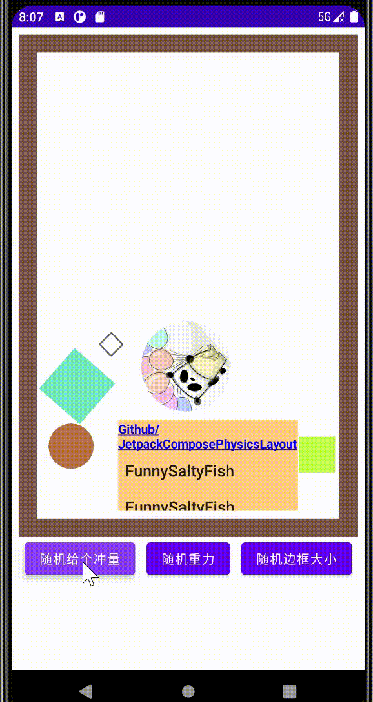

## Jetpack Compose 自定义布局+物理引擎 = ？
[](https://jitpack.io/#FunnySaltyFish/JetpackComposePhysicsLayout)

[English](README_EN.md)  

本库基于`Compose`自定义布局技术 + `JBox2d` 实现了物理引擎布局。其内部`Composable`会由物理引擎不断运动  


### 效果





所对应代码大致为：

```kotlin
val physicsConfig = PhysicsConfig()

PhysicsLayout(modifier = modifier, physicsLayoutState = physicsLayoutState, boundSize = boundSize.toFloat()) {
    RandomColorBox(modifier = Modifier
        .size(40.dp)
        .physics(physicsConfig, initialX = 300f, initialY = 500f))
    // This one has a circle shape
    // so you need to modify it with not only a `clip()` Modifier to make it "looks like" a circle
    // but also a `physics(physicsConfig.copy(shape = PhysicsShape.CIRCLE)` Modifier to create a circle Body
    RandomColorBox(modifier = Modifier
        .clip(CircleShape)
        .size(50.dp)
        .physics(physicsConfig.copy(shape = PhysicsShape.CIRCLE), 300f, 1000f))
    RandomColorBox(...)
    Checkbox(...)
    Card(...) {
        ...
    }
}
```

这之中的`PhysicsLayout`就是我实现的`物理布局`了

如需体验上图的其他功能，可以在仓库下载[demo](demo.apk)


### 使用

库代码位置位于`physics`模块下，故需先依赖此模块。
```bash
implementation 'com.github.FunnySaltyFish:JetpackComposePhysicsLayout:Tag'
```

布局名为`PhysicsLayout`，基本使用如下：

```kotlin
val physicsConfig = PhysicsConfig()
@Composable
fun PhysicsLayoutTest(modifier: Modifier) {
    // physicsLayoutState 含有物理模拟相关的 physics 类，并提供了两个方法
    // setGravity 和 giveRandomImpulse
    val physicsLayoutState by remember {
        mutableStateOf(PhysicsLayoutState())
    }
    var boundSize by remember {
        mutableStateOf(20)
    }
    PhysicsLayout(modifier = modifier, physicsLayoutState = physicsLayoutState, boundSize = boundSize.toFloat()) {
        // 使用 .physics Modifier指定物理相关
        // initialX/Y 可指定初始位置
        RandomColorBox(modifier = Modifier
            .size(40.dp)
            .physics(physicsConfig, initialX = 300f, initialY = 500f))
        // 如果需要指定为圆形的形状
        // 你需要先使用`clip()` Modifier 让它“看起来”是个圆
        // 再指定`physics(physicsConfig.copy(shape = PhysicsShape.CIRCLE)` Modifier 
        // 让它在物理世界中是个圆形
        RandomColorBox(modifier = Modifier
            .clip(CircleShape)
            .size(50.dp)
            .physics(physicsConfig.copy(shape = PhysicsShape.CIRCLE), 300f, 1000f))
    }
}
```


### 参考

正如标题所言，这是一个自定义布局。关于这方面，我已经写了**5篇文章**详细描述了，感兴趣的同学可以点击我的头像查看。本文所用到的无非就是那里的知识加上`JBox2d`而已，看完之后你也写的出来


#### JBox2d

> JBox2D是开源的2D物理引擎，能够根据开发人员设定的参数，如重力、密度、摩擦系数和弹性系数等，自动进行2D刚体物理运动的模拟。


#### 参考

本布局参考自[Jawnnypoo/PhysicsLayout: Android layout that simulates physics using JBox2D (github.com)](https://github.com/Jawnnypoo/PhysicsLayout)，其中部分代码也来自于那里，在此表示诚挚的感谢！( 不过我进行了大量的修改，以使原先用于 `View`的代码被用于`Compose`）


### 实现

#### 定义

首先，我们先来想一个事情：现在每个物体其实都有自己的**位置、大小、形状**这些参数，那么**父布局怎么获得这些值**呢？如果你读过我的[深入Jetpack Compose——布局原理与自定义布局（四）ParentData](https://juejin.cn/post/7073307559792214024)，估计可以想到：这是利用`ParentData`传递的。所以咱们先写个自定义的`ParentData`吧

```kotlin
class PhysicsParentData(
    var physicsConfig: PhysicsConfig = PhysicsConfig(),
    var initialX: Float = 0f,
    var initialY: Float = 0f,
    var width: Int = 0,
    var height: Int = 0
)
```

`PhysicsConfig`代表基本的物理配置，我们先不细究，其余的就是**初位置和宽高了**。


有了`ParentData`，那是不是也得有对应的修饰符和作用域啊，所以咱们写一写

```kotlin
interface PhysicsLayoutScope {
    @Stable
    fun Modifier.physics(physicsConfig: PhysicsConfig, initialX : Float = 0f, initialY : Float = 0f) : Modifier
}

internal object PhysicsLayoutScopeInstance : PhysicsLayoutScope {
    @Stable
    override fun Modifier.physics(
        physicsConfig: PhysicsConfig,
        initialX: Float,
        initialY: Float
    ): Modifier = this.then(PhysicsParentData(physicsConfig, initialX, initialY))
}
```

上面的代码都很简单，属于是自定义`Modifier`的基本操作了，如果你看不懂可以先了解了解再来


#### 使用

现在`Modifier`的定义差不多了，接下来就是使用了。其实总结下来就是这个过程

1. 初始化各个物体和世界

2. 用代码不断模拟一下各个物体的运动过程
3. 在Layout过程中获取位置并正确摆放出来

咱们分别来看*（下面的内容只是我的思路，有些地方可能不太优雅，如果您有更好的想法欢迎指出！）*

整体来说，应该有一些代码专门负责物理模拟的过程，这一部分在代码中为`Physics`类，它负责进行具体的`物理世界创造`、`进行物理模拟`等过程。此处不赘述。


##### 初始化

考虑到各子微件的具体信息要到`Layout`才能读取到，所以似乎只能在这里初始化；但是`Layout`又会反复进行，而初始化应该只进行一次。所以用个变量来控制吧

```kotlin
var initialized by remember {
    mutableStateOf(false)
}
```

然后第一次`Layout`时读取各`ParentData`并存起来

```kotlin
val placeables = measurables.mapIndexed { index,  measurable ->
    val physicsParentData = (measurable.parentData as? PhysicsParentData) ?: PhysicsParentData()
    if (!initialized){
        parentDataList.add(index, physicsParentData)
    }
    measurable.measure(childConstraints)
}
```

然后开个副作用，在所有**物体信息**初始化好后创建世界并创建**Body**（在`JBox2d`中代表`刚体`的类）

```kotlin
// 初始化世界
LaunchedEffect(initialized){
    if (!initialized) return@LaunchedEffect
    physics.createWorld { body, i ->
        parentDataList[i].body = body
    }
}
```

其中`createWord`方法负责创建`Body`并在每个`Body`创建完后回调


##### 不断模拟

模拟的工作交给`JBox2d`，我们要做的就是`不断`就行。所以`while`循环吧

```kotlin
LaunchedEffect(key1 = Unit){
    while (true){
        delay(16)
        physics.step() // 模拟 16ms
    }
}
```


##### 读取并正确放置

这个就很简单了，在`Layout`方法里`layout()`中读一下各个`Body`的位置并`place`就行

不过这里注意，因为`Body`有旋转角度，所以在`place`的时候需要使用`placeWithLayer`，该方法签名如下：

```kotlin
fun Placeable.placeWithLayer(
    position: IntOffset,
    zIndex: Float = 0f,
    layerBlock: GraphicsLayerScope.() -> Unit = DefaultLayerBlock
)
```

其中第三个参数`layerBlock`就提供了`缩放、选择`等方法。具体代码是：

```kotlin
layout(constraints.maxWidth, constraints.maxHeight){
    placeables.forEachIndexed { i, placeable: Placeable ->
        val x = physics.metersToPixels(parentDataList[i].x).toInt() - placeable.width / 2
        val y = physics.metersToPixels(parentDataList[i].y).toInt() - placeable.height / 2
          
        placeable.placeWithLayer(IntOffset(x,y), zIndex = 0f, layerBlock = {
             rotationZ = parentDataList[i].rotation
        })
    }
}
```

上面的`metersToPixels`用于将**物理世界的坐标映射到现实**

完工！


### 后续

其实目前来看，代码里还有些地方感觉不大对劲，比如，为了触发`Layout`过程，我实际使用了一个并无任何用处的`state`。因为在我的尝试里，只要`layout`块里不出现`state`的变化，它就不会重新触发（这点当然符合Compose的感觉喽）；我想不到什么好点子，只好这么处理了。如果大家有什么好想法，欢迎探讨和PR

如果你好奇有什么用……额，我也不知道有什么实际用处。我就是觉得很好玩儿，很早之前就想做了，最近下定决心，两天完成，感觉效果还不错。

如果你对Compose完整项目感兴趣，欢迎看看我的开源项目[FunnySaltyFish/FunnyTranslation: 基于Jetpack Compose开发的翻译软件，支持多引擎、插件化~](https://github.com/FunnySaltyFish/FunnyTranslation)
